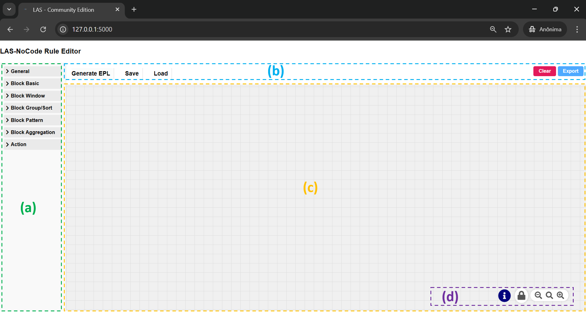

## LAS-NoCode Rule Editor User Interface

- Supported on any modern web browser
- Access URL: http://<*your-address-host*>:5000

## Rule Editor Structure

The Rule Editor is composed of the following components:

**(a) Side Menu**: Provides access to the building blocks used to define and construct rules. [See the next chapter](side-menu.md)

**(b) Top Menu**: Contains actions to **Generate EPL**, **Save**, and **Load**. Additionally, it includes controls to **Clear the Editor Workspace** and **Export the Rule Flow**. [See the next chapter](top-menu.md)

**(c) Editor Workspace**: The primary area where rules are designed, configured, and assembled.

**(d) Bottom Control Panel**: Contains the **Information** button and the **Editor Control Buttons**, which manage editor behavior and interactions.
