## Rule Editor Side Menu — Block Usage Rules

The Side Menu of the Rule Editor provides access to all blocks used to define, configure, and assemble rules for Perseo CEP (FIWARE). Each block serves a specific purpose, ranging from general configuration to event selection, filtering, windowing, aggregation, pattern detection, and actions.

Connection to the Rule

All blocks, with the exception of GROUP BY and ORDER BY, must be directly connected to a rule.

Each block is intended to be used one at a time when connected to the rule.

GROUP BY and ORDER BY blocks are different: they are used to extend an existing SELECT instruction, and therefore are connected to a SELECT block instead of directly to the rule.

This structure ensures that each block generates a valid and complete EPL instruction when the user clicks Generate EPL, while maintaining the rule’s modular and composable design.

With this connection model, users can safely build rules by adding one block at a time, directly to the rule, or by extending SELECT statements with grouping or sorting as needed.

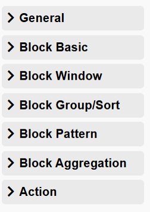

The blocks are organized by functionality, supporting a step-by-step approach to rule creation and facilitating both simple and advanced rule definitions.

---

### General

The **General** section contains configuration elements that apply to the rule as a whole.

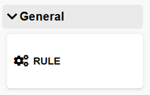

#### Rule Name

This block allows the user to define the **name of the rule** being created.
The rule name is used to identify the rule within the editor and during export or integration processes.

* The rule name should be **unique and descriptive**.
* It is recommended to use meaningful names that reflect the rule’s purpose or behavior.

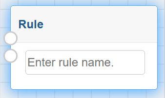

---

### Block Basic

The **Block Basic** section provides the essential building blocks for defining the core logic of a rule. These blocks can be used independently or combined with other blocks available in the editor.

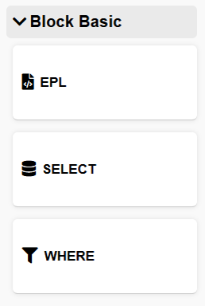

#### EPL Block

The **EPL** block allows users to create **fully customized rules** using the Perseo syntax, which is based on **Event Processing Language (EPL)**.

* This block is intended for **advanced users**.
* It requires prior knowledge of **Perseo CEP** and **EPL syntax**.
* The rule logic is written manually by the user.
* The content defined in this block is used directly during rule generation.

This block offers maximum flexibility and control over rule behavior.

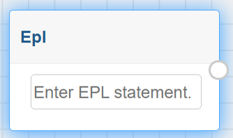

---

#### SELECT Block

The **SELECT** block provides a **simplified way to define event attribute selection** without requiring knowledge of EPL.

* The user only needs to specify the **attribute name(s)** of interest from the incoming events.
* The complete EPL instruction is **automatically generated** when the user clicks **Generate EPL**.
* This block is suitable for users who prefer a guided, low-complexity rule creation process.

The SELECT block generates the base structure of an EPL statement.

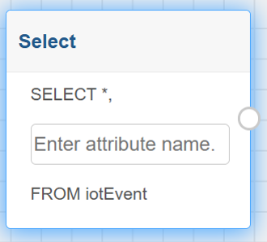

---

#### WHERE Block

The **WHERE** block allows users to **apply filters to events**, extending the functionality of the SELECT block.

* The user specifies:

  * The **attribute** to be filtered.
  * The **filter condition** to be applied.
* No knowledge of EPL syntax is required.
* The filtering logic is automatically translated into a valid EPL instruction during **Generate EPL**.

This block enables rule refinement by restricting event selection based on specific conditions.

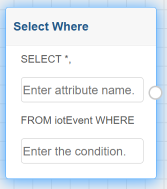

---

Together, the **EPL**, **SELECT**, and **WHERE** blocks provide different levels of abstraction, allowing both beginners and advanced users to create rules efficiently.

## Block Window

The **Block Window** menu provides blocks used to define **event windows** that control how events are observed and selected based on **time** or **quantity**.
These blocks generate **standalone window-based EPL statements** and are intended for simple event monitoring scenarios.

The window blocks do not support aggregations, patterns, or conditional logic. When more complex rule logic is required, including combinations of windows, aggregations, conditions, or patterns, users should use the **EPL block**, where full control over the rule structure is available.

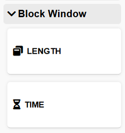

---

### TIME Window Block

The **TIME** block is used to define a **time-based event window**, specifying a fixed interval during which events are monitored.

* The block follows the same structure as the **SELECT** block.
* The user selects the **attribute of interest** and defines the **time window duration**.
* No conditions, aggregations, or patterns are applied.

The generated EPL instruction follows the format:

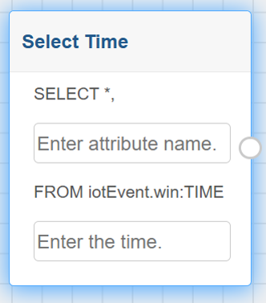

This block is suitable for scenarios where events must be observed within a specific time interval, without additional processing or filtering logic.

---

### LENGTH Window Block

The **LENGTH** block is used to define a **count-based event window**, specifying the number of events to be monitored.

* The block follows the same structure as the **SELECT** block.
* The user selects the **attribute of interest** and defines the **number of events**.
* No conditions, aggregations, or patterns are applied.

The generated EPL instruction follows the format:

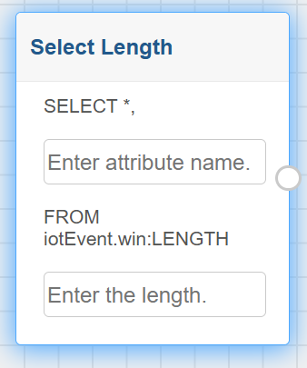

This block is appropriate for use cases where rule evaluation depends on a fixed number of the most recent events, without additional processing logic.

---

The **TIME** and **LENGTH** window blocks provide a simplified and direct way to define event windows.

## Block Group/Sort

The **Block Group/Sort** menu provides blocks used to **group** or **order** the results of a rule. These blocks operate on the output of a **SELECT-based instruction** and must be connected to a block that defines a `SELECT` clause.

The **GROUP BY** and **ORDER BY** blocks do not define a rule by themselves. Instead, they extend an existing SELECT instruction by adding grouping or sorting behavior. The corresponding EPL syntax is generated automatically during **Generate EPL**.

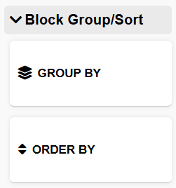

---

### GROUP BY Block

The **GROUP BY** block is used to group events based on the value of a specific attribute.

* This block must be connected to a block that contains a **SELECT** instruction.
* The user only needs to specify the **attribute** used for grouping.
* The grouping logic is automatically appended to the SELECT statement.

This block is typically used in scenarios where events need to be analyzed or processed per entity, category, or identifier, such as grouping events by device, type, or location.

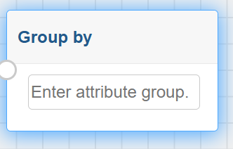

---

### ORDER BY Block

The **ORDER BY** block is used to define the **sorting order** of the events selected by a SELECT instruction.

* This block must be connected to a block that contains a **SELECT** instruction.
* The user specifies the **attribute** used for ordering.
* The sorting logic is automatically generated and added to the SELECT statement.

This block is useful when the rule output needs to be ordered, for example, by timestamp, value, or priority.

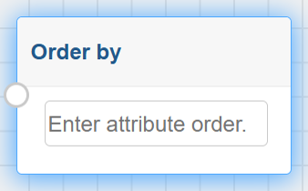

---

The **GROUP BY** and **ORDER BY** blocks allow users to refine the result set of a rule without requiring direct interaction with EPL syntax.

## Block Pattern

The **Block Pattern** menu provides blocks used to define **event patterns**, enabling the detection of specific sequences or combinations of events. Pattern-based rules are a powerful feature of **Perseo CEP**, based on Esper, and allow users to model complex event behavior.

The blocks in this menu are intended for **advanced use cases** and require knowledge of **EPL pattern syntax**. Depending on the selected block, the user may define the pattern manually or use a partially structured configuration that generates the corresponding EPL instruction.

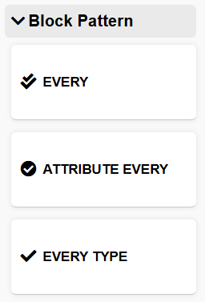

---

### Every Block

The **Every** block allows users to define a **fully customized event pattern**.

* The user manually specifies the pattern logic.
* The resulting rule depends entirely on the pattern expression provided.
* Knowledge of **EPL pattern syntax** is required.

This block provides maximum flexibility for defining complex event sequences, correlations, or temporal relationships.

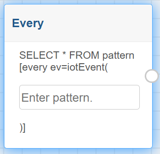

---

### Attribute Every Block

The **Attribute Every** block allows users to define a pattern based on the `every` operator.

* The user specifies the **attribute of interest** and defines the pattern logic.
* Knowledge of **EPL pattern syntax** is required to correctly define the pattern.
* The complete EPL instruction is generated automatically.

This block is commonly used to detect recurring or repeated event patterns.

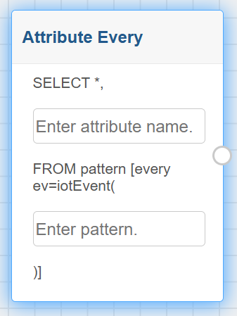

---

### Every Type Block

The **Every Type** block extends the functionality of the **Attribute Every** block by allowing the user to specify the **entity type** associated with the selected attribute.

* The user specifies:

  * The **attribute of interest**.
  * The **entity type** related to the attribute.
  * The pattern logic.
* Knowledge of **EPL pattern syntax** is required.
* The EPL instruction is generated automatically.

This block is useful in scenarios where pattern detection must be restricted to a specific entity type, providing more precise event correlation.

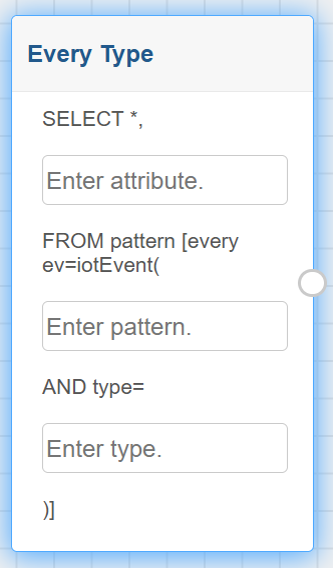

---

The **Block Pattern** menu enables advanced event pattern detection.

## Block Aggregation

The **Block Aggregation** menu provides blocks used to apply **aggregation functions** over event streams. Aggregations allow users to compute summary values based on the events selected by a rule, such as averages, counts, or totals.

These blocks must be connected to a block that defines a **SELECT** instruction. The user only needs to specify the **attribute of interest**, and the corresponding aggregation logic is automatically generated during **Generate EPL**. No direct knowledge of EPL syntax is required.

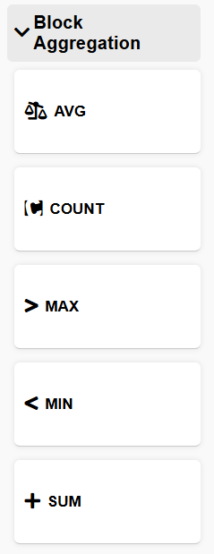

---

### AVG Block

The **AVG** block calculates the **average value** of the specified attribute over the selected events.

* The user specifies the attribute to be aggregated.
* The average is computed based on the events considered by the rule.

This block is commonly used to monitor trends or typical values in event data.

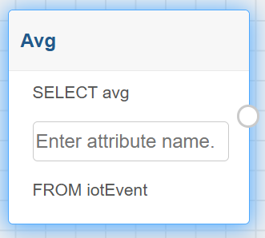

---

### COUNT Block

The **COUNT** block calculates the **number of events** in the selected event set.

* The user specifies the attribute of interest.
* The count reflects the total number of events processed by the rule.

This block is useful for detecting activity volume or frequency.

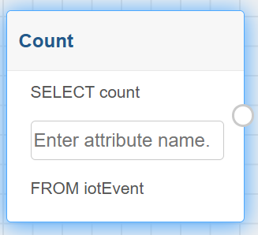

---

### MAX Block

The **MAX** block returns the **maximum value** of the specified attribute among the selected events.

* The user specifies the attribute to be evaluated.
* The highest observed value is selected.

This block is typically used to detect peak values.

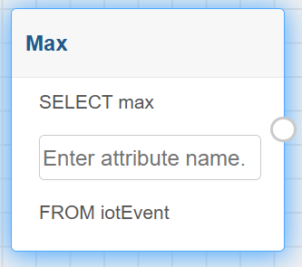

---

### MIN Block

The **MIN** block returns the **minimum value** of the specified attribute among the selected events.

* The user specifies the attribute to be evaluated.
* The lowest observed value is selected.

This block is useful for identifying minimum thresholds or baseline values.

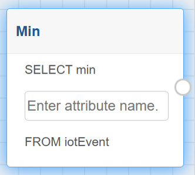

---

### SUM Block

The **SUM** block calculates the **sum of all values** of the specified attribute.

* The user specifies the attribute to be aggregated.
* The total is computed over the selected events.

This block is commonly used for cumulative measurements.

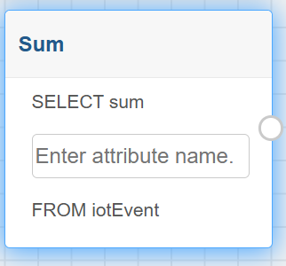

---

The aggregation blocks enable users to extract meaningful summaries from event streams in a simplified manner.

## Block Action

The **Block Action** menu defines how **notifications generated by a rule are delivered** to users or external systems. Action blocks specify the output behavior of a rule after its conditions, patterns, or aggregations are evaluated.

These blocks are responsible for configuring the notification mechanism and formatting the information sent when a rule is triggered.

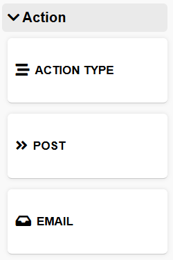

The Action Type block must be directly connected to the rule, as it represents the final step of the rule definition and determines how the rule output is communicated.

---

### Action Type Block

The **Action Type** block allows the user to select the **notification delivery method**.

The available options are:

* **POST**
* **EMAIL**

Based on the selected action type, the corresponding configuration block becomes available.

---

### POST Action Block

The **POST** action block configures the rule to send notifications to an **external endpoint** using an HTTP POST request.

* The user specifies the **URL** where the notification will be sent.
* The user defines a **template** used to format the notification message.
* The template can include values of the attributes defined in the rule.

This action type is commonly used to integrate the rule with external services, applications, or APIs.

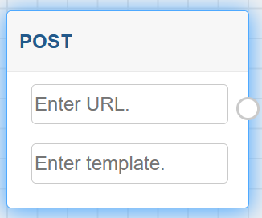

---

### EMAIL Action Block

The **EMAIL** action block configures the rule to send notifications via **email**.

* The user specifies:

  * The **sender address (from)**.
  * The **recipient address (to)**.
  * The **email subject**.
  * The **message template**.
* The template defines the content of the notification and may include values from the rule attributes.

This action type is suitable for delivering notifications directly to users in a readable and accessible format.

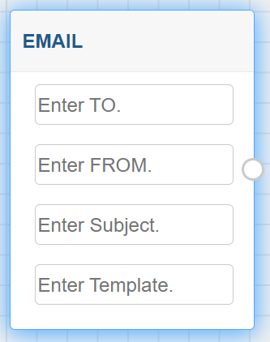

---

The **Block Action** menu allows users to define how rule results are communicated. By combining Action blocks with the other building blocks of the Rule Editor, users can create complete rules that detect events and deliver notifications through different channels.
