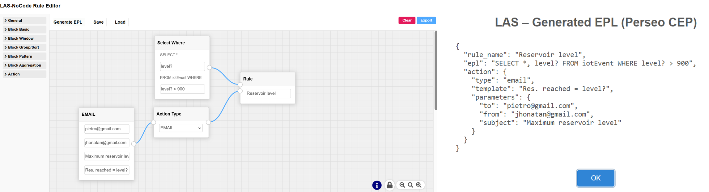

# Summary

Complex Event Processing (CEP) supports real-time detection of patterns and anomalies over continuous event streams and is widely adopted in Internet of Things (IoT), smart environments, and distributed systems. Despite mature execution engines, rule definition typically depends on textual domain-specific languages such as Event Processing Language (EPL), which increases cognitive load and introduces variability in rule specification.

LAS-NoCode Rule Editor (LAS) is an open-source, containerized, low-code web application that enables structured visual construction of CEP rules. LAS represents rules as directed block graphs and automatically generates syntactically valid EPL compatible with Perseo CEP within the FIWARE ecosystem. The system is designed to support reproducible experimentation, structured rule modeling, and educational adoption in event-driven systems research.

Figure 1: LAS-NoCode Rule Editor interface showing visual construction of a CEP rule using connected blocks (left) and the automatically generated EPL rule compatible with Perseo CEP (right), enabling direct deployment to the CEP engine.

# Statement of need

CEP engines provide scalable and efficient runtime infrastructures, yet rule authoring remains largely manual and text-based. This creates challenges for:

- Teaching event-driven architectures and CEP concepts.
- Rapid prototyping of event patterns in research scenarios.
- Reproducible specification of rule logic across experiments.

In research contexts, rule definitions are often embedded in configuration files or scripts without structured modeling support, making controlled experimentation and replication more difficult.

LAS addresses this limitation by introducing a visual abstraction layer aligned with CEP semantics. The system:

- Encodes rule logic as structured block-based flows.
- Enforces consistent rule composition patterns.
- Automatically translates visual models into EPL.
- Enables containerized deployment for reproducible environments.
* Integrates natively with Perseo CEP infrastructures within the FIWARE ecosystem.

By formalizing the rule authoring layer, LAS reduces syntactic variability in rule definitions, improves accessibility for students and researchers, and supports reproducible experimentation in event-driven IoT research workflows.

# State of the field

CEP has been a recognized research and industrial field since the formalization of event pattern detection models [@luckham2002cep]. Engines such as Esper [@espertech] provide expressive EPL-based rule definition and efficient in-memory execution. Distributed stream processing frameworks including Apache Flink [@carbone2015flink] and Kafka Streams [@kreps2011kafka] extend event processing to large-scale, fault-tolerant environments.

Within the FIWARE ecosystem, Perseo CEP [@fiwareperseo] offers rule-based event processing integrated with context management services. However, these systems primarily focus on runtime execution and scalability rather than structured rule modeling or visual abstraction.

Visual flow-based tools such as Node-RED [@node-red] enable event-driven composition through graphical interfaces, but they are not specifically designed for EPL generation or CEP rule modeling.

Previous work by Zimmerle de Lima [@zimmerle] implemented a Node-RED plugin for Perseo CEP, enabling event-driven mashups for IoT scenarios. The plugin allows users to integrate sensor readings, actuators, dashboards, and alerts through Node-RED’s flow-based programming model.

While this approach facilitates rapid prototyping and benefits from Node-RED’s active ecosystem, it requires the installation and knowledge of Node-RED and relies on generic flow constructs that do not enforce CEP-specific rule semantics or automated EPL generation.

In contrast, LAS-NoCode Rule Editor provides a standalone domain-specific visual environment for CEP rule construction. Rules are represented as directed block graphs and automatically translated into EPL compatible with Perseo CEP. LAS does not depend on Node-RED or additional platforms, reducing setup complexity and making it more accessible to students and researchers.

This distinction allows LAS to reduce syntactic variability, enforce consistent rule composition patterns, and enhance reproducibility, while preserving the accessibility benefits of visual programming for educational and research contexts.

LAS contributes at the intersection of CEP and low-code tooling by:

1. Providing a domain-specific visual modeling environment tailored to CEP rule construction.
2. Automating the transformation from visual rule graphs into executable EPL code.
3. Supporting reproducible experimental workflows through containerized deployment using Docker [@docker].

# Software design

LAS is implemented as a modular web application composed of:

- Backend: Python with Flask [@flask].
- Frontend: JavaScript-based block editor built on Drawflow [@drawflow].
- Deployment: containerized environment using Docker [@docker].

Rules are internally represented as directed block graphs. The backend parses the graph into an intermediate representation and generates EPL statements. The generated rules follow the EPL structure expected by Perseo CEP and can be deployed directly to the engine through REST-based integration.

The system can operate as a standalone web application or as a Flask Blueprint embedded into larger systems. Containerization ensures consistent execution across development, experimentation, and teaching environments, supporting reproducibility in research settings.

# Acknowledgements

The author thanks the open-source communities behind Flask, Docker, Drawflow, and FIWARE for providing the tools that enabled the development of LAS-NoCode Rule Editor.

# References